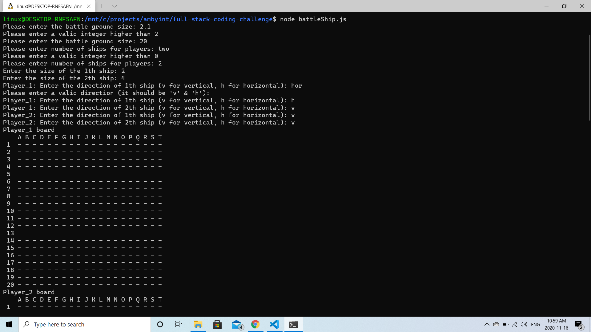
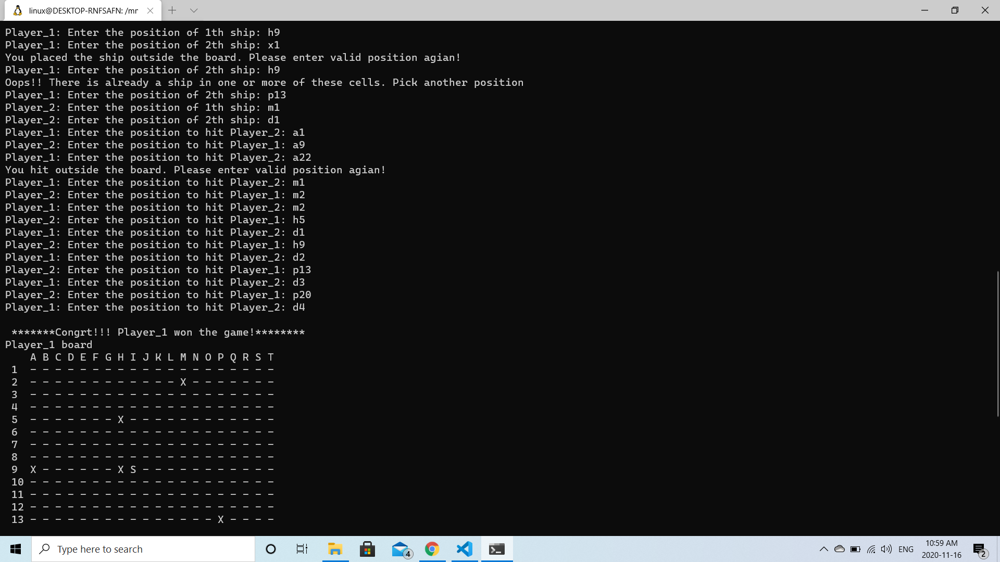
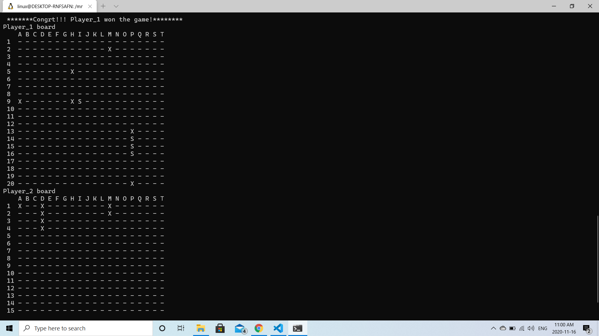
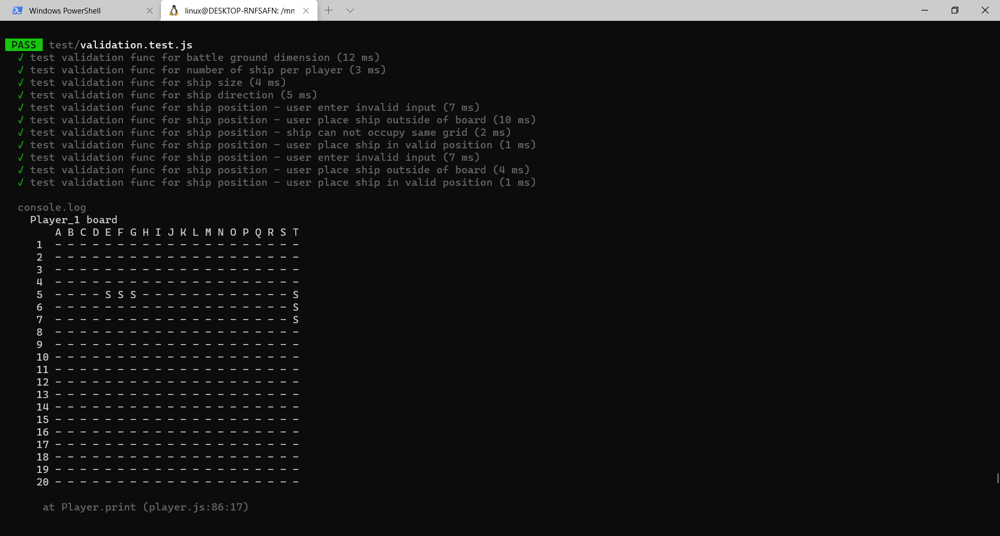

# Battleship

## Description
A simplified implementation of the classic game, Battleship.

## Instructions
To play the game run the following command.
```javascript
npm start
```

To run the tests, use the following command. 
```javascript
npm run test
```

Please note that Jest might not work with older version of Node. The recommended version to run the test is: **v10.23.0**


## Features
- A two-player game that each player has a board. 
- Player can choose the board size at the begining and the board size will be the same for both players.
- Player can choose how many ships they want to have. The number of ships will be the same for both player.
- Player can choose the length of the ship. The length of the ship will be the same for both player.
- Player place their ships one after another. They can place their ships horizontally or vertically.
- Players take turns firing at their opponents ship.
- The game prints the board at the end of the game and annouces the winnner.

## User-input Validation
- Program check every user-input to make sure it's correct or in the right format.
- Program let user know if he/she placed his/her ship outside fo the board.
- Program let user know if his/her ship does not fit the board.
- Program let user know if he/she placed his/her on another ship.
- Program let user know if he/she fires his/her shot outside of the board.

## Challanges
- Deciding on the general frame of the code.
- Using Promise, Async and Await features made the code readibility much better. 

## Output
Below is a snapshot of output.







